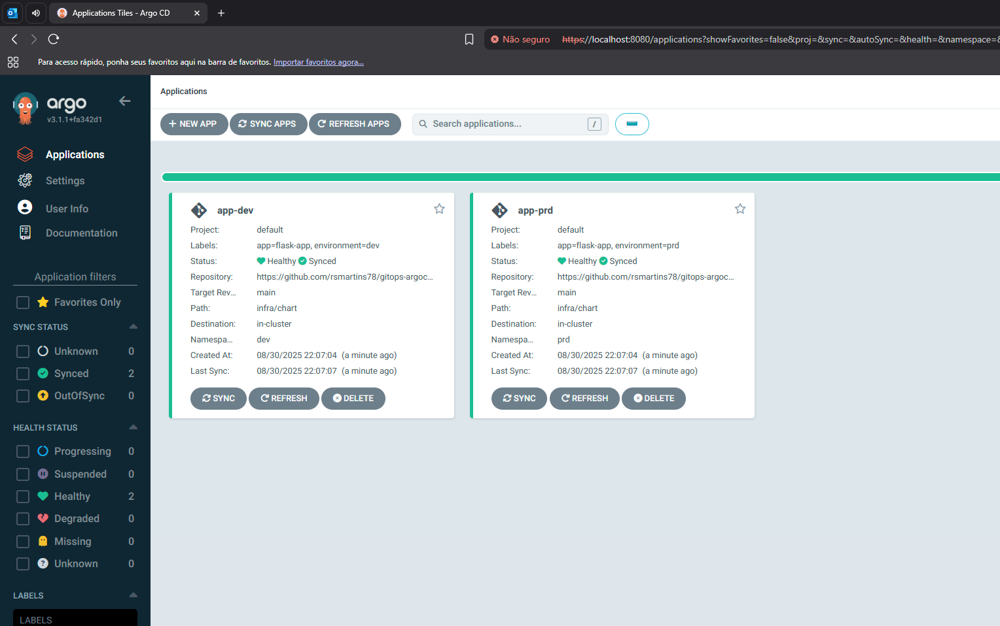
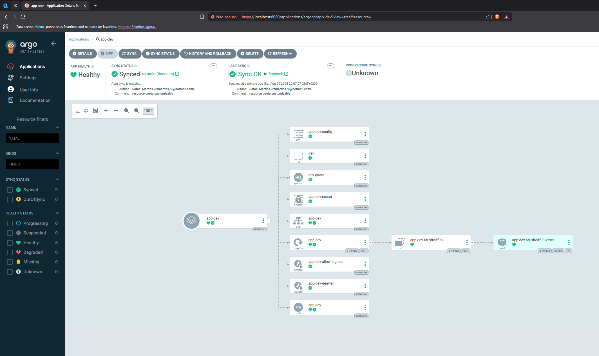
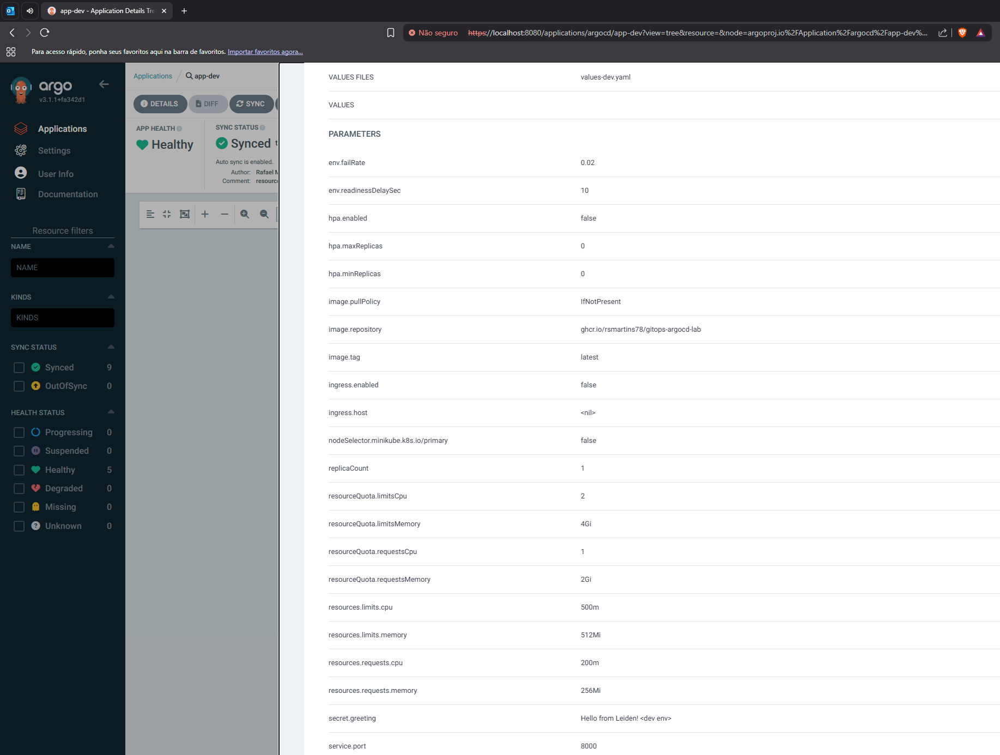
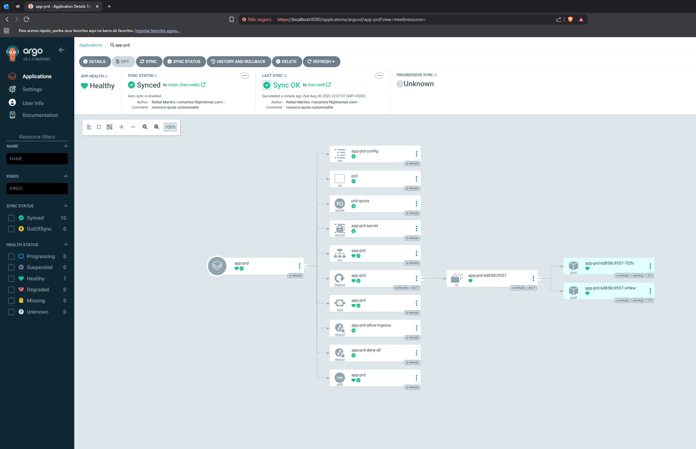

# SOLUTION.md

## Overview

This solution demonstrates a production-grade deployment of a stateless Flask application on Kubernetes, managed via GitOps with ArgoCD. The repository is structured to support multi-environment deployments (dev, prd) using Helm and ArgoCD ApplicationSet, following best practices for security and scalability.

---

## Part 1 – Kubernetes Setup

### Cluster Topology

- **Assumption:** For this assignment, the cluster is set up with minikube, so worker and control plane are the same, making it not possible to use nodeSelector or podAntiAffinity, but the code is written and commented. Ideally, on real environments, production and non-production environments wouldn't share the same cluster or even network.
- **Node Placement:** nodeSelector used to tell the scheduler which nodes are the right ones to assign the pods; podAntiAffinity policy to ensure multiple replicas won't run on the same node, ensuring availability in case of node failure.

### Namespace & Isolation

- Each environment (dev, prd) is deployed in its own namespace, on the same cluster.
- NetworkPolicies:
  - Default deny-all policy for strict isolation.
  - Allow ingress only from the ingress controller and monitoring namespaces for service and metrics access.

### Workload Controller

- **Deployment** is used for stateless, scalable, and upgradable workloads.
- **RollingUpdate** strategy ensures zero-downtime deployments.
- **podAntiAffinity** to ensure pods are deployed on different nodes.
- **nodeSelector** to ensure the pods are scheduled to the right node pool, based on labels.
- **tolerations** were not added, but those can help assign and use the right node pools in case of node restriction with taints.

### Service Exposure

- **Service** is of type ClusterIP by default, considering this type of service (API) can be served through an ingress like NGinx, Kong or Envoy.
- **Ingress** is optional and controlled by a flag (`ingress.enabled`). When enabled, it exposes the app via a customizable host (defaults to nginx for simplicity).

### Application Configuration

- **Secrets:** The `GREETING` environment variable is sourced from a Kubernetes Secret.
- **ConfigMap:** `READINESS_DELAY_SEC` and `FAIL_RATE` are sourced from a ConfigMap.
- **Environment Variables:** All configuration is managed declaratively via Helm values and can be overriden per environment.

### Security

- **SecurityContext:** The container runs as a non-root user (UID 10001), with a read-only root filesystem, no privilege escalation, and all Linux capabilities dropped.

### Resource Management

- **Requests/Limits:** Set for both CPU and memory, with higher values in production (`values-prd.yaml`) due its possibly higher load.
- **ResourceQuota:** Each namespace includes a ResourceQuota (see `infra/chart/templates/resourcequota.yaml`) to enforce maximum resource usage per environment. This prevents a single environment from exhausting cluster resources and supports safe multi-tenancy. Example limits: requests.cpu: 1, requests.memory: 2Gi, limits.cpu: 2, limits.memory: 4Gi.
- **Justification:** Ensures fair scheduling, prevents noisy neighbor issues, and supports autoscaling. ResourceQuota is essential in multi-tenant clusters to avoid resource starvation and enforce organizational policies.

### Health Probes

- **Readiness and Liveness Probes:** Configured to `/readyz` and `/healthz` endpoints, with initial delays to account for app startup.

### Scaling & Availability

- **HPA:** Optional and controlled by `hpa.enabled`. When enabled, HPA uses both CPU and memory metrics, with advanced scaling policies (stabilization windows, scaling tolerance). On production-ready setups, keda project can also be used together with hpa to extent the capabilities of the autoscaling; Metrics server is required in order to make HPA work, on minikube it must be enabled as an addon, for managed Kuberentes offerings like EKS, GKE or AKS, they come preinstalled and modified by the cloud provider to ensure compatibility.
- **PodDisruptionBudget:** Ensures at least one pod is always available during voluntary disruptions, very useful and necessary especially during scheduled or unsupervised maintenances.

### Monitoring

- **NetworkPolicy** allows monitoring namespace to scrape metrics.
- **Recommendation to the development team:** Expose metrics under a different port to avoid exposing metrics externally, also helps with the Network Policy, ensuring only the monitoring tool can reach the metrics endpoint/port.

---

## Part 2 – GitOps with ArgoCD

### ArgoCD Setup

- Setup steps were automated with a shell script `setup.sh`.
- kubectl, minikube and docker are required before using the script.
- The script will start a minikube cluster with 1 control plane and 3 worker nodes, enable some addons, then install ArgoCD.
- ArgoCD is installed in the `argocd` namespace.
- The admin password and a command to port-forward to Argo Server is printed.

### Multi-Environment Management

- **ApplicationSet** is used to deploy the app to both `dev` and `prd` namespaces.
- Each environment uses its own values file (`values-dev.yaml`, `values-prd.yaml`) for environment-specific configuration (replica count, resources, etc.).
- All manifests are templated; only values files differ per environment.

### Sync Policy

- Automated sync with pruning and self-healing enabled.
- Namespaces are created automatically if they do not exist.

### How to Deploy

1. **Build and Push Docker Image:**
   - A Github Actions workflow was added to build and push the image to GHCR.
   - The provided `deploy.sh` script will check if the docker image is ready, if yes, it will apply the ArgoCD ApplicationSet.

2. **ArgoCD UI:**
   - Keep the password printed after running `setup.sh` or retrieve it again with `kubectl -n argocd get secret argocd-initial-admin-secret -o jsonpath="{.data.password}" | base64 -d; echo`.
   - Start a port-forward to access the UI with `kubectl port-forward svc/argocd-server -n argocd 8080:443`
   - Access the ArgoCD UI to monitor the status of the apps and manage both environments, force syncs and (hard)refreshes.

> **ArgoCD page with both apps, dev and prd.**

> **ArgoCD page showing dev env specific parameters.**

> **ArgoCD page showing prd env specific parameters.**

---

## Design Decisions & Justifications

- **Helm**: Chosen for its flexibility, templating, and packaging feature, making it easier to version it.
- **ArgoCD ApplicationSet**: Enables scalable, templated and DRY GitOps for multiple environments. If deploying more than one app, The concept "App of Apps" is the best approach. 
- **Security**: All best practices enforced (non-root, minimal privileges, network isolation), with a possible improvement on the application image, to use distroless or other minimal container image (not applied).
- **Scalability**: HPA and resource requests/limits ensure the app can handle variable load, the implementation is the basic based on metrics server, but keda.sh is a project that extends HPA capabilities.
- **Reliability**: Rolling updates, PDB, podAntiAffinity and health probes ensure high availability.
- **Multi-tenancy**: Namespaces, NetworkPolicies support safe multi-tenant operation.
- **Resource Quotas**: Disabled by default, enabled via env-especific values.yaml file to enforce resource boundaries and prevent resource exhaustion. Values can also customized per environment, as each env might have different requirements or resources available.

---

## Trade-offs & Assumptions

- **kustomize** would be simpler to use, but the overall templating of Helm is better, especially if the team decides to version the chart.
- **Monitoring**: Assumes a monitoring namespace exists and is allowed by NetworkPolicy.

---

## How to Extend

- Add more environments by extending the ApplicationSet and adding new values files.
- Enable/disable Ingress and HPA per environment via values files.
- Integrate with external secrets or advanced monitoring as needed.

---
